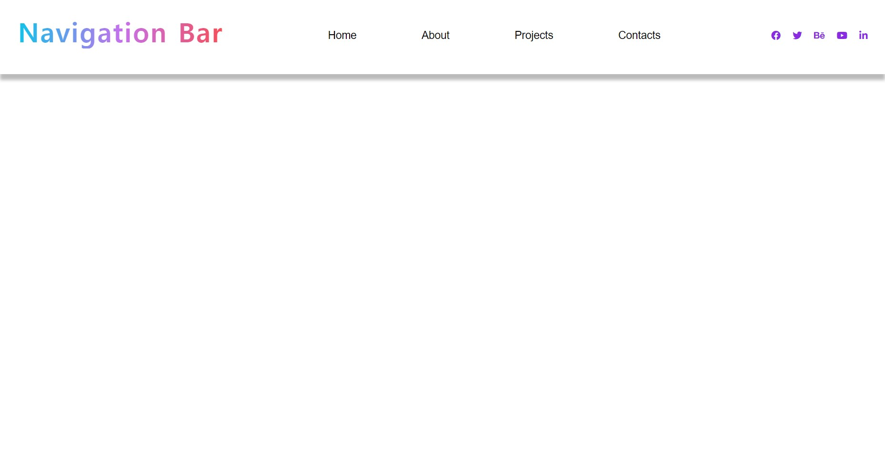
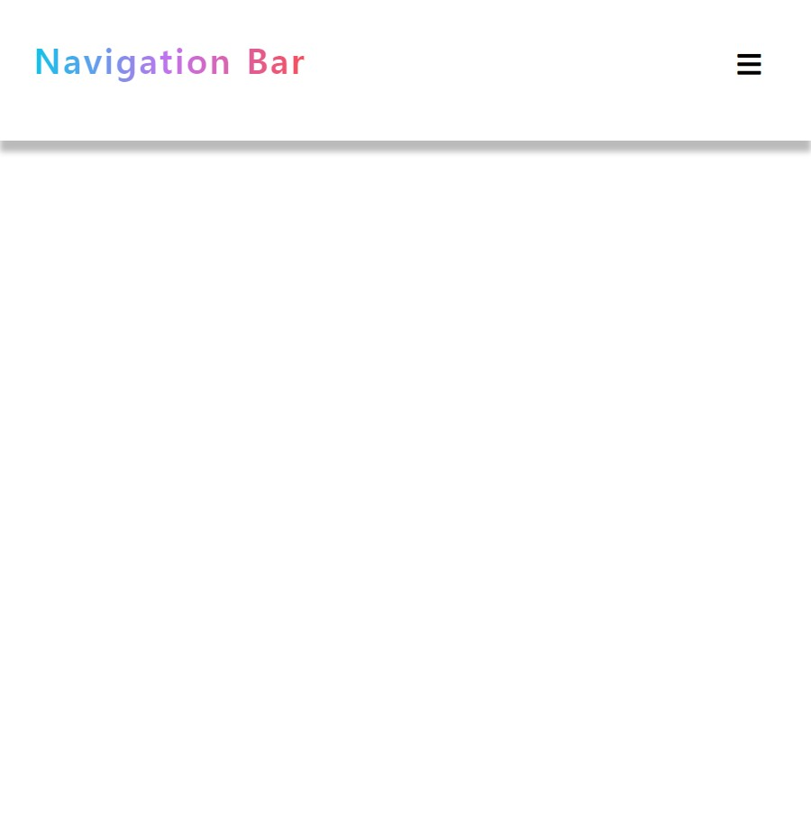
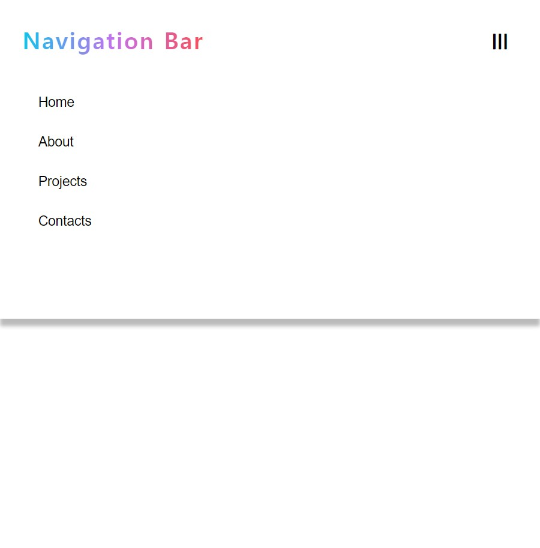

# Nav-Bar
 
<ol>
  <li><strong>프로젝트 이름</strong> : Nav Bar</li>
  <li><strong>사용 언어</strong> : HTML, CSS, Vanila Javascript</li>
  <li><strong>주요 기능</strong> 
    <ul>
      <li>화면 크기가 일정 폭 이상으로 줄어들 경우 nav bar 호출 버튼이 화면 우측 상단에 나타납니다. 클릭시, 숨어있던 nav bar가 표시됩니다.</li>
    </ul>
   </li> 

   
  
  <h5> 초기화면 </h5>
  
  <h5> Nav Bar 표시 </h5>
  
  <h5> Nav Bar 클릭시 </h5>
  
  

  

  
